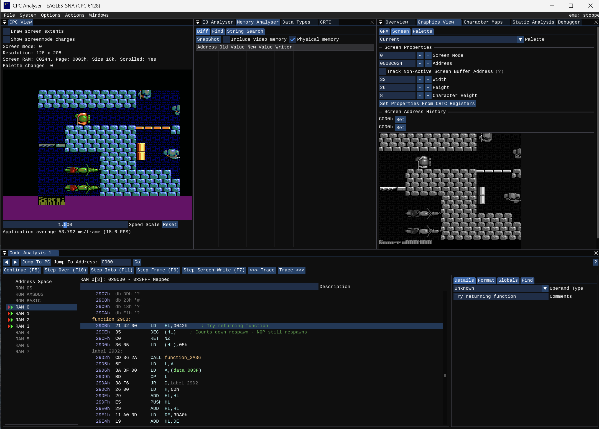
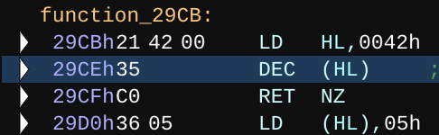

# Into The Eagles Nest

## Overview
The 1987 Pandora 8-bit game Into The Eagle's Nest Amstrad CPC looking at disassembly for understanding how game works. There are already cheats / pokes available on the excellent cpc-power.com website

### Compare Formats
There are many platforms that Into The Eagles Nest was released on and these are compared on [this retro gaming blog](https://frgcb.blogspot.com/2017/04/into-eagles-nest-pandora-1987.html) .

8-bit: Amstrad CPC, ZX Spectrum, Commadore 64, Apple II, IBM-PC

16-bit: Atari ST, Commadore Amiga

### Amstrad CPC
One of the best resources for the Amstrad CPC version is the french website [PC-Power.com](https://www.cpc-power.com/index.php?page=detail&num=1173) including a comparison of versions, maps and tape and disc images.
* Disk: 30 June 1987
* Disk: 27 Nov 1987
* Tape

**CPC Analyser**

I'm working on macOS but some of the best tools I have seen are on Windows so running [Windows 11 VM via UTM](https://mac.getutm.app) to use [CPC Analyser](https://colourclash.co.uk/cpc-analyser/) . There is a good [Cheat finding with CPC Analyser](https://www.youtube.com/watch?v=oeHA8gAnf74) video on Youtube.




**Stop Enemy Respawn - Cheat**

There are already cheats for infinte health, infinte ammo, infinite keys and to freeze enemies. I was keen to stop enemies respawning as always felt it detracted from the game when enemies could appear from "dead ends" or cleared rooms behind you.

I looked for a counter that decreased from 5 and looped based on the need to check for respawn every 5 frames. The ```function_29CB``` seemed to be part of the respaen logic.



Change from: **21** 42 00 35 C0 to: **C9** 42 00 35 C0 and the function will not run. Identify this sequence on the disk image and use a hex editor to edit to make a dsk with the no enemy respawn cheat.


### Amiga ASM
There is an [Amiga version ASM on Github](https://github.com/hitchhikr/eaglenest/blob/main/src/eagle.asm)
https://github.com/hitchhikr/eaglenest/tree/main


[Map details](Maps.md) between the Amiga and Amstrad CPC the detail for the map of blocks aand block layout mean castle 1 on Amiga is the same as the Amstrad CPC map.
